# 택이네 조개전골 — Hệ thống quản lý kho

> 🇰🇷 [한국어](README.md) · 🇻🇳 **Tiếng Việt**

Ứng dụng quản lý kho thật cho nhà hàng Hàn Quốc, viết bằng React + TypeScript + Vite.

> **Quy tắc ngôn ngữ:** toàn bộ giao diện người dùng là **100% tiếng Hàn**.
> Code, biến, kiểu dữ liệu, enum trong DB dùng tiếng Anh; mọi giá trị hiển thị
> lên màn hình đều được chuyển sang tiếng Hàn qua `src/lib/labels.ts`.

## Giới thiệu các màn hình

Ảnh chụp từ app đang chạy với dữ liệu mẫu (menu thật của quán, 60 ngày lịch sử giả lập).
Chụp lại bất cứ lúc nào bằng `npm run screenshots` khi dev server đang bật.

### Dashboard — nhìn một cái là biết hôm nay ra sao

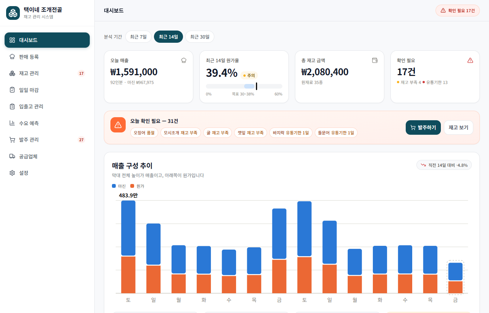

Bốn chỉ số đầu: doanh thu hôm nay, tỉ lệ giá vốn 14 ngày (kèm dải mục tiêu), tổng tiền
tồn kho, số việc cần xử lý. Banner cam liệt kê ngay món nào hết, món nào sắp hết hạn.
Biểu đồ cột chồng: **chiều cao cột = doanh thu, phần dưới = giá vốn, phần trên = lãi gộp** —
cuối tuần cao hẳn lên là thấy ngay.

### Bán hàng — bấm số phần, kho tự trừ theo công thức

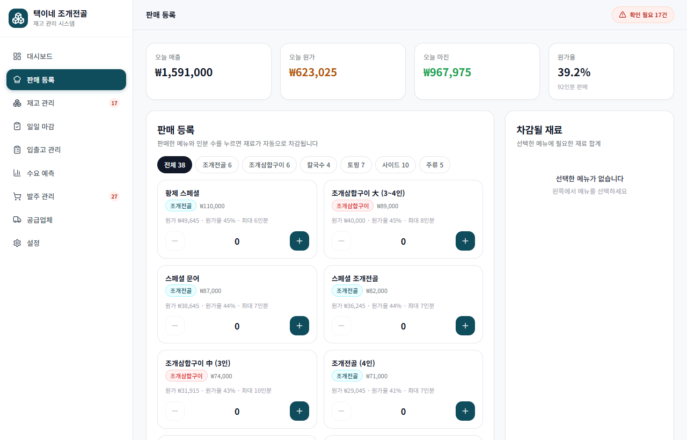

38 món đúng theo menu quán, lọc theo mục (조개전골 · 조개삼합구이 · 칼국수 · 토핑 · 사이드 · 주류).
Mỗi thẻ hiện giá vốn, tỉ lệ giá vốn và **còn làm được bao nhiêu phần** với tồn kho hiện tại.
Bấm `+` là bên phải hiện ngay tổng nguyên liệu sẽ bị trừ — thiếu món nào báo đỏ trước khi xác nhận.

### Kho — trạng thái, hạn dùng, ngày dự kiến hết

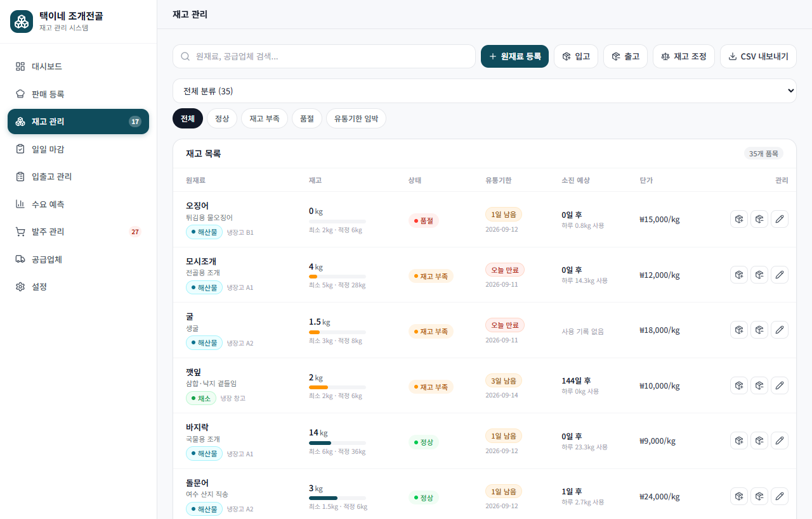

35 nguyên liệu, 10 phân loại. Mỗi dòng: tồn hiện tại so với mức tối thiểu/hợp lý (thanh màu),
trạng thái `정상 / 재고 부족 / 품절`, hạn dùng còn bao nhiêu ngày, và **dự kiến bao nhiêu ngày
nữa hết** dựa trên tốc độ dùng thực tế.

### Quét hoá đơn — chụp ảnh là ra bảng nhập kho

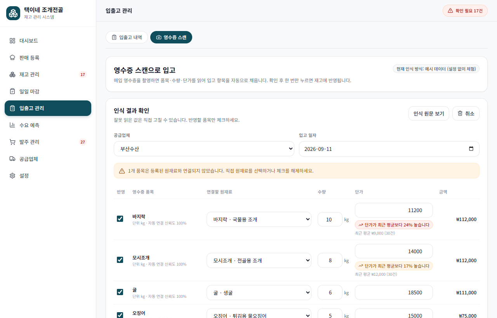

Sau khi nhận dạng, mỗi dòng hoá đơn được **tự khớp với nguyên liệu trong kho** (신뢰도 100%).
Dòng không khớp bị bỏ chọn và cảnh báo vàng. Ngay tại ô đơn giá có **cảnh báo lệch giá** —
"단가가 최근 평균보다 24% 높습니다" kèm giá trung bình 30 lần nhập gần nhất. Sửa số xong bấm
một nút là toàn bộ vào kho.

### Kiểm kê cuối ca — đếm số còn lại, hệ thống tìm chỗ thất thoát

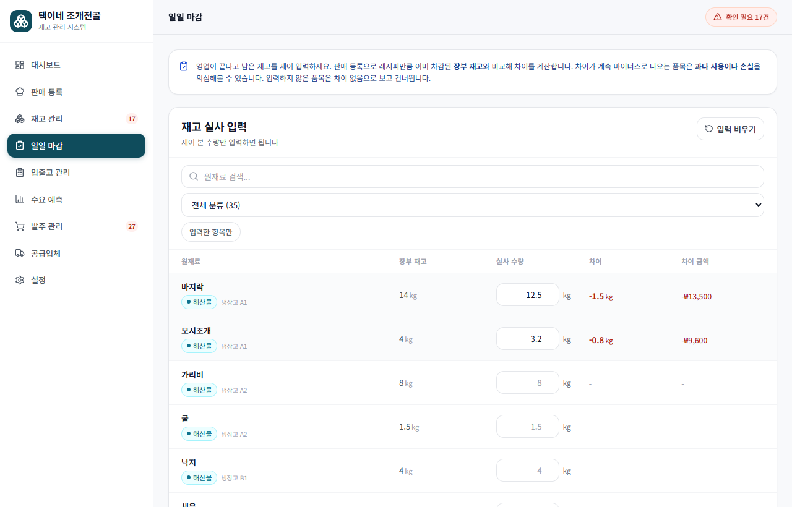

Chỉ nhập món nào đếm thấy khác sổ. Chênh lệch hiện ngay theo kg và theo tiền (đỏ = thiếu,
xanh = dư). Xác nhận là kho về đúng số đếm. Làm nhiều lần, bảng "반복해서 손실이 나는 원재료"
sẽ chỉ ra món nào **cứ thiếu hoài** — dấu hiệu múc quá tay hoặc thất thoát.

### Đặt hàng theo thứ trong tuần — thứ Bảy đông thì đặt nhiều hơn

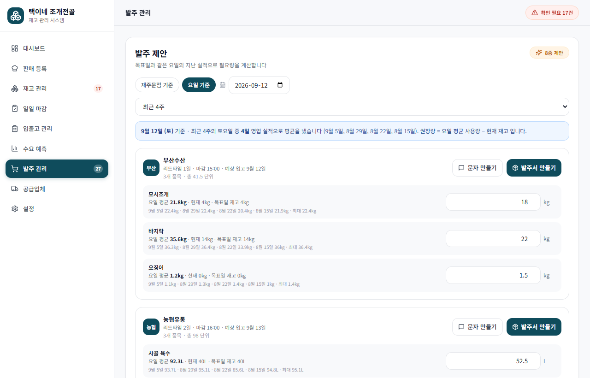

Chọn ngày cần hàng, hệ thống lấy **4 ngày cùng thứ gần nhất** tính trung bình tiêu hao,
trừ đi lượng sẽ dùng trong các ngày ở giữa, ra số cần đặt. Mỗi dòng hiện đủ 4 mẫu để
đối chiếu: `9월 10일 19.1kg · 9월 3일 17.9kg · ...`. Dữ liệu mẫu cho thấy 바지락 thứ Bảy dùng
35kg nhưng thứ Hai chỉ 18kg — trung bình động thường sẽ đặt sai cả hai ngày.

### Phiếu đặt hàng — in được, gửi được

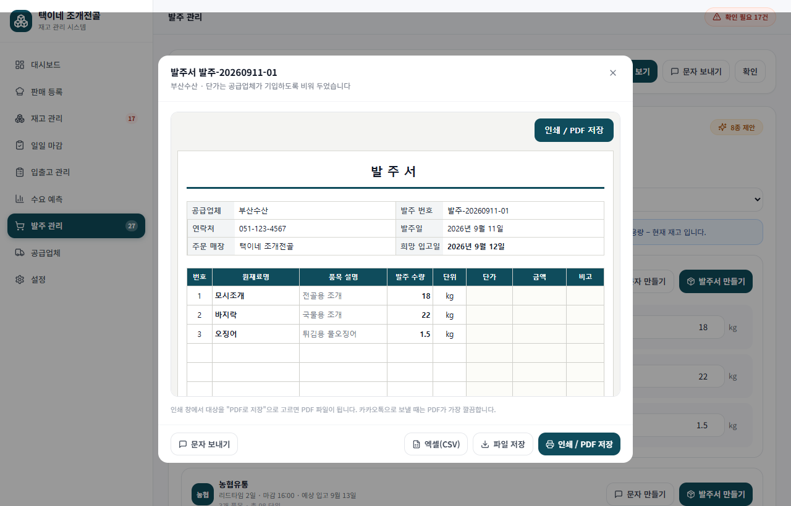

Bấm `발주서 만들기` là ra ngay tờ phiếu có khung. **Cột 단가/금액 để trống có chủ đích** —
giá hải sản do nhà cung cấp quyết. Nút `인쇄 / PDF 저장` xuất PDF gửi KakaoTalk; ngoài ra có
`문자 보내기` soạn sẵn tin nhắn tiếng Hàn để dán thẳng vào chat.

### Dự báo nhu cầu

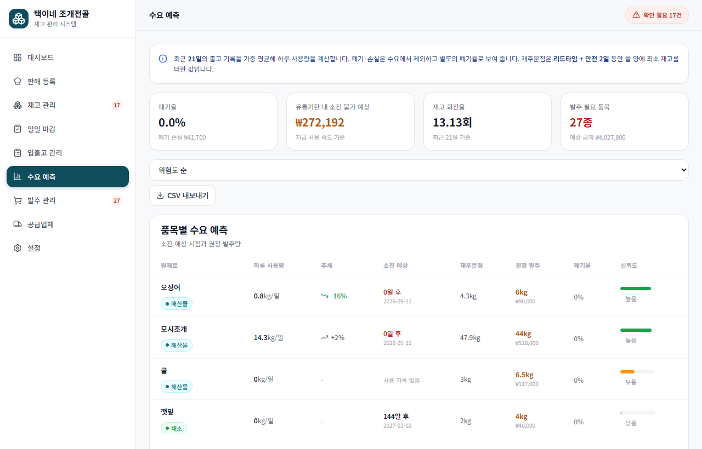

Tốc độ dùng/ngày, xu hướng so với tuần trước, ngày hết dự kiến, điểm đặt lại, lượng đề xuất,
**tỉ lệ huỷ bỏ** (tách riêng khỏi nhu cầu), và độ tin cậy của từng dự báo.

### Công thức món ăn — giá vốn tự tính

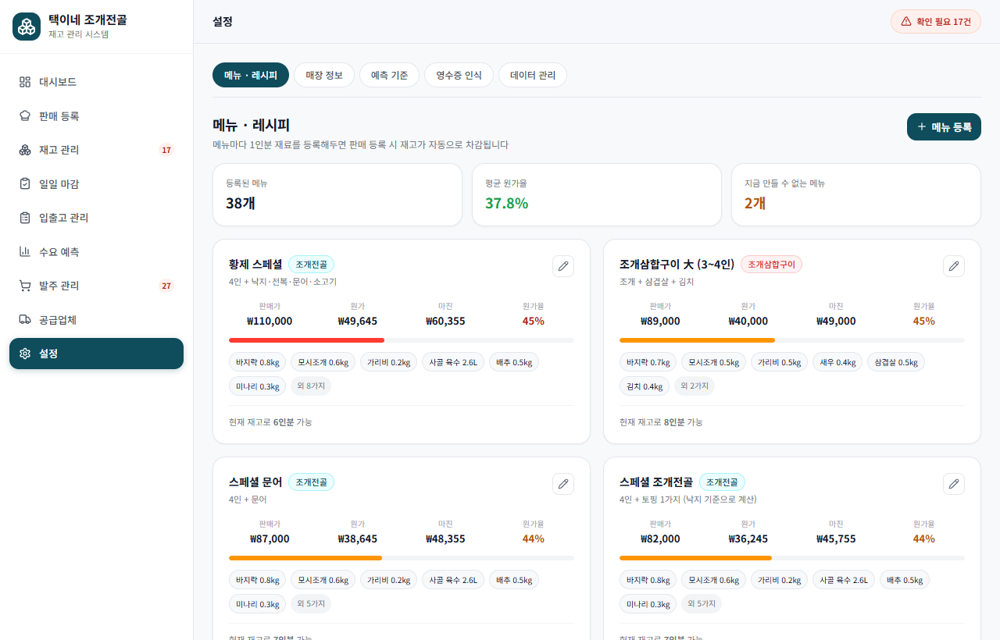

Trong `설정 → 메뉴 · 레시피`. Khai báo nguyên liệu cho 1 phần, giá vốn và tỉ lệ giá vốn
tự ra. Thanh màu cảnh báo món nào vượt ngưỡng. Đây là nơi cần chỉnh cho đúng công thức thật
của quán — một khi đúng, toàn bộ số liệu khác đúng theo.

### Trên điện thoại

<p>
  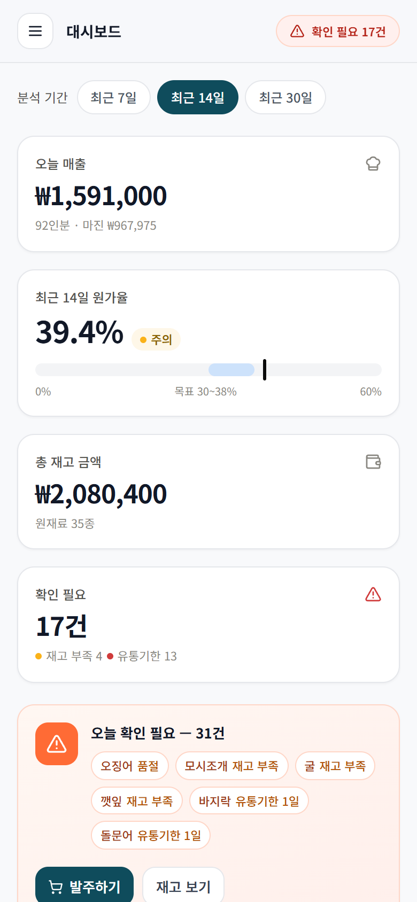
  &nbsp;&nbsp;
  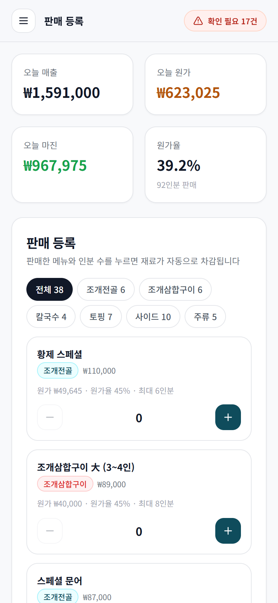
</p>

Toàn bộ màn hình co lại vừa điện thoại, menu thu vào nút ☰. Nút bấm đủ lớn để thao tác
bằng ngón tay khi đang bận trong bếp.

---

## Chạy thử

```bash
npm install
npm run dev
```

Mở http://localhost:5178

```bash
npm run build      # build production vào dist/
npm run typecheck  # kiểm tra kiểu
```

## Tính năng

### 0. Công thức món ăn (`설정` → tab `메뉴 · 레시피`)
Khai báo mỗi món ăn tiêu hao bao nhiêu nguyên liệu cho 1 phần.

- **Giá vốn / margin / tỉ lệ giá vốn (`원가율`) tự tính** cho từng món, có thanh
  cảnh báo màu khi vượt ngưỡng
- Biết được **hiện tại còn làm được bao nhiêu phần**, và **nguyên liệu nào hết trước**
- Màn hình `판매 등록`: bấm số phần đã bán → xem trước toàn bộ nguyên liệu sẽ bị trừ
  (gộp chung nếu nhiều món dùng cùng một nguyên liệu) → xác nhận là trừ kho + ghi
  doanh thu, không phải nhập tay từng dòng nguyên liệu
- Cảnh báo trước nếu có nguyên liệu không đủ

> Vì bán hàng sinh ra giao dịch xuất kho thật, nên phần **dự báo nhu cầu tự động
> chính xác hơn** mà không cần thêm code — nó vẫn đọc từ lịch sử xuất kho như cũ.

### 1. Quản lý kho thật (có lưu dữ liệu)
- Dữ liệu lưu trong `localStorage`, không mất khi tải lại trang
- Thêm/sửa/ẩn nguyên liệu, nhà cung cấp
- Nhập kho / xuất kho / kiểm kê điều chỉnh, mỗi thao tác ghi một giao dịch
- Trạng thái tồn kho theo đúng quy tắc: `정상` / `재고 부족` / `품절`
- Cảnh báo hạn sử dụng riêng: `유통기한 임박` / `오늘 만료` / `유통기한 경과`
- Xuất CSV (có BOM UTF-8 để Excel không vỡ chữ Hàn)
- Sao lưu / phục hồi toàn bộ dữ liệu bằng file JSON

### 2. Dự báo nhu cầu (`수요 예측`)
- Tính mức dùng trung bình/ngày bằng **trung bình động có trọng số** (ưu tiên ngày gần)
- **Loại bỏ phần hao hụt/huỷ bỏ** khỏi nhu cầu, tách ra thành chỉ số tỉ lệ huỷ riêng
- Ngày dự kiến hết hàng (`소진 예상`)
- Xu hướng 7 ngày gần nhất so với 7 ngày trước đó
- Độ tin cậy dự báo (dựa trên lượng dữ liệu + độ ổn định)
- Lượng tồn có nguy cơ không dùng hết trước hạn → quy ra tiền
- Vòng quay kho (`재고 회전율`)

### 3. Hỗ trợ đặt hàng (`발주 관리`)
Hai chế độ dự báo, chuyển bằng nút `재주문점 기준` / `요일 기준`:

**Theo điểm đặt lại (`재주문점 기준`)**
- Điểm đặt hàng lại = (mức dùng/ngày × (lead time + số ngày an toàn)) + tồn tối thiểu
- Phù hợp cho hàng khô, gia vị — dùng đều mỗi ngày

**Theo thứ trong tuần (`요일 기준`)** — dành cho hải sản tươi
- Chọn ngày cần hàng (ví dụ thứ Năm) → hệ thống lấy **4 thứ Năm gần nhất** (bỏ qua ngày
  nghỉ), tính trung bình tiêu hao từng nguyên liệu
- Trừ đi lượng dự kiến dùng trong các ngày **giữa hôm nay và ngày đó** (mỗi ngày cũng
  tính theo thứ của nó) để ra tồn kho dự kiến sáng hôm đó
- Đề xuất = trung bình thứ đó − tồn dự kiến, làm tròn theo đơn vị
- Hiện rõ 4 mẫu dữ liệu để bạn thấy độ dao động (ví dụ: `9월 10일 19.1kg · 9월 3일 17.9kg · ...`)
- Đổi được số tuần lấy mẫu (3/4/6/8)

Lý do cần chế độ này: nhà hàng bán theo thứ rất rõ — dữ liệu mẫu cho thấy 바지락 thứ 7 dùng
35kg nhưng thứ 2–4 chỉ 18kg. Trung bình động thường sẽ đặt thừa cho ngày thường và thiếu cho
cuối tuần.

- Tự gom các mặt hàng cần đặt **theo từng nhà cung cấp**
- Đề xuất số lượng đặt để bù về mức tồn hợp lý, làm tròn theo đơn vị
- Vòng đời phiếu đặt hàng: `작성 중` → `발주 완료` → `입고 완료`
- Bấm "입고 처리" là tự cộng vào kho và sinh giao dịch nhập

### 4. Quét ảnh hoá đơn (`입출고 관리` → tab `영수증 스캔`) — tính năng chính
Chụp ảnh hoá đơn → đọc ra bảng hàng → kiểm tra → bấm 1 lần là vào kho.

- Chụp trực tiếp bằng camera điện thoại hoặc chọn ảnh có sẵn
- Ảnh được **thu nhỏ về 1600px** trước khi gửi đi để tiết kiệm dung lượng/chi phí
- **Tự khớp tên hàng trên hoá đơn với nguyên liệu đã đăng ký** (so khớp mờ theo bigram);
  dòng nào không khớp sẽ bị bỏ chọn và cảnh báo để người dùng tự chọn
- Sửa được số lượng / đơn giá ngay trên bảng kiểm tra
- Xác nhận → sinh giao dịch nhập kho hàng loạt, cập nhật luôn đơn giá và hạn dùng

#### Ba chế độ nhận dạng (đổi trong màn hình `설정`)

| Chế độ | Mô tả |
|---|---|
| `claude` | Dùng Claude vision qua official SDK. Chính xác nhất với hoá đơn tiếng Hàn. Cần API key của bạn. |
| `tesseract` | Chạy hoàn toàn trong máy, miễn phí, không cần mạng. Độ chính xác thấp hơn với hoá đơn in nhiệt. |
| `demo` | Không đọc ảnh thật, trả về hoá đơn mẫu. Dùng để xem toàn bộ luồng mà không cần cấu hình. |

Mặc định là `demo` để chạy được ngay. Muốn dùng thật thì vào `설정` → chọn
`Claude 이미지 인식` → dán API key.

**Lưu ý bảo mật:** app gọi thẳng API từ trình duyệt
(`dangerouslyAllowBrowser`), nên API key nằm trong `localStorage` của máy đó.
Chỉ dùng trên máy cá nhân. Nếu sau này triển khai cho nhiều nhân viên dùng
chung, cần đẩy phần gọi API ra một server nhỏ ở giữa để giấu key.

### 4b. Cảnh báo biến động giá
Ngay trong bảng kiểm tra sau khi quét hoá đơn, mỗi dòng so đơn giá vừa đọc được với
**trung bình các lần nhập gần đây** (60 ngày, cần tối thiểu 2 lần nhập để có cơ sở):

- Lệch >= 10% -> nhắc nhở (vàng), >= 20% -> cảnh báo (đỏ), rẻ hơn -> báo xanh
- Hiện đúng câu `단가가 최근 평균보다 18% 높습니다` kèm giá trung bình và số lần nhập
- Chỉ cảnh báo, **không chặn** — bạn vẫn bấm xác nhận được
- Cùng cảnh báo đó cũng hiện ở ô đơn giá của màn hình nhập kho thủ công

### 4c. Gửi phiếu đặt hàng qua KakaoTalk
Nút `문자 만들기` (ở đề xuất đặt hàng) và `문자 보내기` (ở phiếu đã tạo) sinh sẵn tin nhắn
tiếng Hàn để dán thẳng vào KakaoTalk:

```
[택이네 조개전골] 발주 요청 (발주-20260911-01)

부산수산님, 안녕하세요.
아래 품목으로 발주 부탁드립니다.

- 바지락 22.5kg
- 모시조개 18kg

합계: ₩878,500
희망 입고일: 2026년 9월 12일

확인 후 회신 부탁드립니다. 감사합니다.
```

Nút copy có **hai tầng dự phòng**: `navigator.clipboard` chỉ chạy trong secure context
(https hoặc localhost), nên khi mở app qua `http://192.168.x.x` từ máy khác nó tự chuyển
sang `document.execCommand`. Nếu cả hai đều bị chặn (trình duyệt không có focus), app tự
bôi đen sẵn nội dung để chỉ cần Ctrl+C, kèm dòng hướng dẫn.

### 4d. Kiểm kê cuối ca (`일일 마감`)
Cuối ca chỉ cần đếm số còn lại rồi nhập vào — không phải ghi từng lần dùng.

- So **재고 실사** với **장부 재고** (đã tự trừ theo công thức món ăn từ phần bán hàng)
- Chênh lệch hiện ngay theo số lượng và quy ra tiền, đỏ = thiếu, xanh dương = dư
- Chỉ nhập những món cần; món bỏ trống coi như không lệch và được bỏ qua
- Xác nhận -> tự sinh giao dịch `재고 조정` lý do `실사 차이`, kéo tồn kho về đúng số đếm
- **`반복해서 손실이 나는 원재료`**: cộng dồn qua nhiều lần mà cứ thiếu -> lộ ra chỗ đang
  thất thoát hoặc múc quá tay (ví dụ: "바지락 · 마감 3회에서 부족 · 누적 3.1kg · -₩27,900")
- Lịch sử từng lần kiểm kê, bấm vào xem chi tiết từng nguyên liệu

### 5. Dashboard trực quan
- **Biểu đồ cột chồng "매출 구성 추이"**: chiều cao cột = doanh thu, phần dưới =
  giá vốn, phần trên = margin. Hai giá trị cùng đơn vị nên **chỉ dùng một trục** —
  không bao giờ dùng dual-axis. Hover ra tooltip đủ doanh thu / giá vốn / margin /
  tỉ lệ giá vốn. Chỉ ghi số trực tiếp ở cột cao nhất.
- **Thanh đo tỉ lệ giá vốn**: một con số lớn + dải mục tiêu 30–38%, kèm nhãn chữ
  (`적정` / `주의` / `높음`) chứ không chỉ dựa vào màu.
- **Heatmap `요일별 매출 패턴`**: 8 tuần × 7 ngày, đậm nhạt theo doanh thu — nhìn ra
  ngay ngày nào trong tuần đông khách.
- **Thanh tỉ trọng theo phân loại**: dùng một màu với các mức đậm nhạt (màu thể hiện
  thứ hạng, không phải danh tính), gom phần đuôi vào "그 외".
- Chọn được kỳ phân tích 7 / 14 / 30 ngày, mọi biểu đồ đổi theo.

Bảng màu được **kiểm bằng script**, không ước lượng bằng mắt: cặp giá vốn/margin
đạt CVD ΔE 24.7 và ΔE thị lực thường 33.6 trên nền trắng; thang 4 mức của biểu đồ
tỉ trọng đạt đơn sắc, độ sáng đơn điệu, mức nhạt nhất tương phản 2.11:1.

## Cấu trúc

```
src/
  types.ts              kiểu dữ liệu miền
  store.tsx             state toàn cục + reducer + tự lưu localStorage
  lib/
    labels.ts           BẢN ĐỒ enum → nhãn tiếng Hàn (nơi duy nhất)
    format.ts           định dạng ko-KR (tiền, ngày, %)
    forecast.ts         dự báo theo trung bình động & điểm đặt hàng lại
    weekdayForecast.ts  dự báo theo thứ trong tuần (cùng thứ, N tuần gần nhất)
    seed.ts             dữ liệu mẫu + 60 ngày lịch sử giả lập
    storage.ts          đọc/ghi localStorage
    csv.ts              xuất CSV kèm BOM
    menu.ts             giá vốn món ăn, hiệu quả bán hàng, heatmap
    priceTrend.ts       thống kê đơn giá nhập & cảnh báo lệch giá
    shiftClose.ts       đối chiếu kiểm kê & thống kê thất thoát
    message.ts          soạn tin nhắn đặt hàng cho KakaoTalk
    clipboard.ts        copy có dự phòng cho ngữ cảnh không bảo mật
    ocr/
      index.ts          chọn provider theo cài đặt
      claudeProvider.ts gọi Claude vision (structured output bằng zod)
      tesseractProvider.ts
      demoProvider.ts
      parseText.ts      tách dòng hàng từ text OCR thô
      match.ts          khớp mờ tên hàng ↔ nguyên liệu
  components/           UI dùng chung, modal
  pages/                9 mục menu (영수증 스캔 nằm trong tab của 입출고 관리)
```

## Ghi chú kỹ thuật

- `zodOutputFormat` của Anthropic SDK yêu cầu schema **zod v4**, nên
  `claudeProvider.ts` import từ `zod/v4` (đường dẫn con mà zod 3.25 cung cấp).
- Mọi thay đổi tồn kho **bắt buộc đi qua `moveStock`**. Không được gọi
  `upsertIngredient` ngay sau `moveStock` với object lấy từ state cũ — sẽ ghi đè
  mất phần tồn kho vừa cộng. Việc cập nhật đơn giá / nhà cung cấp / hạn dùng khi
  nhập kho đã được xử lý sẵn bên trong reducer.
- Ảnh hoá đơn đã phản ánh vào kho sẽ bị xoá khỏi bộ nhớ khi lưu, để không
  vượt hạn mức `localStorage`.
- Khoá lưu trữ là `taekine-inventory-v3`. Lịch sử được sinh theo đúng chuỗi
  **bán hàng → công thức → trừ nguyên liệu** nên doanh thu, giá vốn và mức tiêu hao
  khớp nhau. v3 dùng **menu thật của quán** (38 món, 35 nguyên liệu, 8 nhà cung cấp) —
  bản v1/v2 không dùng lại được.
- Định lượng nguyên liệu mỗi món là **ước tính** để 원가율 rơi vào 22–47%. Sửa cho đúng
  công thức thật trong `설정 → 메뉴·레시피`. Hai chỗ phải quyết định thay cho menu:
  `스페셜 조개전골` ("chọn 1 topping") được tính theo 낙지; `살아있는 여수돌문어`
  ("giá theo cân") tính theo giá cố định trên menu.
- **Đơn giá nguyên liệu giờ là số liệu thật, không còn là trang trí** — nó quyết định
  giá vốn từng món. Khi sửa giá nguyên liệu, `원가율` của mọi món đổi theo.
- Trong biểu đồ, không được dùng nhãn thứ (요일) làm React `key`: nhãn lặp lại trong
  kỳ 14/30 ngày. Dùng `id` là ngày.
- Kiểm kê cuối ca dùng chung `applyMoves` với `absoluteStock`, gộp trong **một action**
  `RECORD_SHIFT_CLOSE` — không tách thành 2 bước (chỉnh kho rồi ghi sổ), tránh trạng thái
  nửa vời khi một bước lỗi.
- Đơn giá nguyên liệu trong seed đã hạ về mức giá sỉ thật, nên hoá đơn mẫu của chế độ
  `demo` cũng được chỉnh theo — chỉ để bạc bạc 바지락 cao hơn ~24% nhằm minh hoạ cảnh báo giá.

## Cài lên Android

Xem **[ANDROID.vi.md](ANDROID.vi.md)** — hướng dẫn đầy đủ 2 cách (PWA qua hosting, hoặc build
APK bằng Capacitor). Project Android đã được dựng sẵn trong `android/`.

```bash
npm run build          # build web + sinh service worker, manifest
npm run android:sync   # build rồi copy vào project Android
npm run android:open   # mở bằng Android Studio để build APK
npm run icons          # vẽ lại icon app
npm run android:icons  # vẽ lại icon launcher của Android
npm run screenshots    # chụp lại ảnh cho README (cần dev server đang chạy)
```

## Dùng chung trong mạng nội bộ

Vite đã bật `host: true` nên server lắng nghe trên mọi card mạng. Máy khác vào bằng
**IP LAN**, không phải `localhost`: `http://<IP-máy-chủ>:5178`. Trên Windows cần mở cổng
một lần bằng PowerShell quyền Administrator:

```powershell
New-NetFirewallRule -DisplayName "Taekine Dev Server" -Direction Inbound -Protocol TCP -LocalPort 5178 -Action Allow -Profile Any
```

Vẫn không vào được thì kiểm tra router có bật AP/Client Isolation không.
